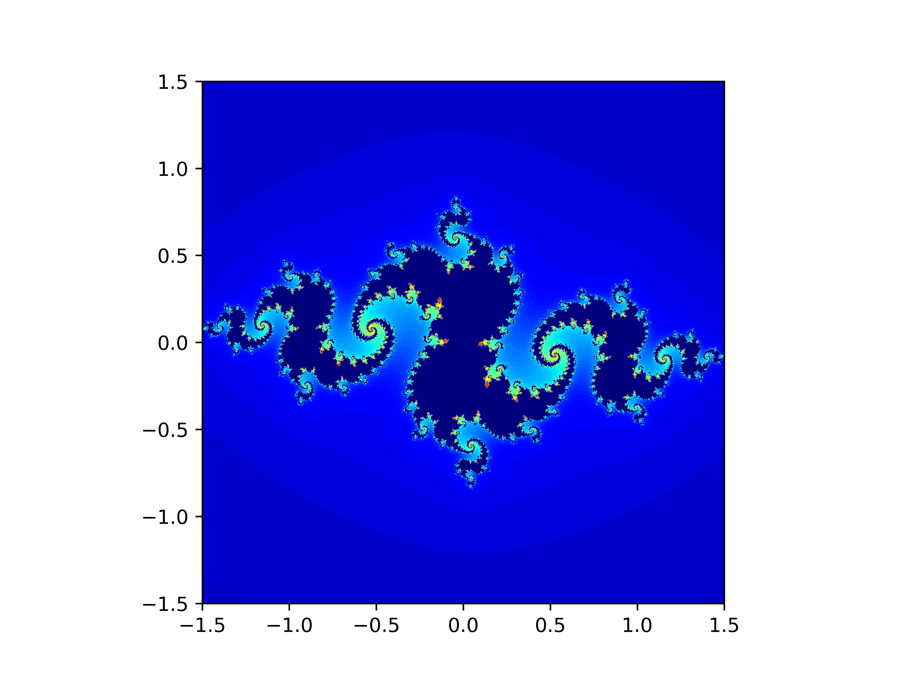

# ジュリア集合生成APIと表示Webサイト

## 目次

- [ジュリア集合生成APIと表示Webサイト](#ジュリア集合生成apiと表示webサイト)
  - [目次](#目次)
  - [アプリケーションの概要](#アプリケーションの概要)
  - [ファイル構成](#ファイル構成)
  - [開発環境](#開発環境)
  - [使用モジュール](#使用モジュール)
  - [制約条件](#制約条件)
  - [コード説明](#コード説明)
    - [Python関数説明](#python関数説明)
      - [cal\_julia(request)](#cal_juliarequest)
      - [check\_input(req\_val)](#check_inputreq_val)
      - [julia(z\_real, z\_img, n\_max, a, b)](#juliaz_real-z_img-n_max-a-b)
      - [create\_graph(result, min\_x, max\_x, min\_y, max\_y)](#create_graphresult-min_x-max_x-min_y-max_y)
    - [Javascript関数説明](#javascript関数説明)
      - [startAPI()](#startapi)


## アプリケーションの概要
本アプリケーションは、HTMLで入力した値からジュリア集合の生成と描画を行うWebアプリです。

HTML上では、
* 実数部最小値min_x
* 実数部最大値max_x
* 虚数部最小値min_y
* 虚数部最大値max_y
* 複素定数comp_const

この5つの値を入力し、描画ボタンを押下していただくと画面中央に生成されたジュリア集合が表示されます。<br>また、以下制約条件を満たさない場合は条件別で以下のエラーを返します。
* 入力するべき値が1つでも未入力の場合<br>
  **```Please input currect value.```**
* min_x,max_x,min_y,max_yの値が実数ではなかった場合<br>
  **```Please input float value.```**
* min_x,max_x,min_y,max_yの値が制約条件外だった場合<br>
  **```Please input min_x, min_y, max_x, max_y between -2 and 2.```**
* comp_constの値が予期せぬ値だった場合<br>
  **```Please input min_x < max_x, min_y < max_y.```**


描画されるジュリア集合は、以下のようになります。

カラーコードは、[matplotlib公式ドキュメント](https://matplotlib.org/stable/users/explain/colors/colormaps.html)を参考に、```jet```を使用し生成を行っています。


##  ファイル構成
今回主に使用・作成したファイル構成は以下の通りです。
```
.
├── README.md
├── build.sh
├── env
├── render.yaml
├── requirements.txt
└── satori
    ├── manage.py
    ├── satori
    │   ├── settings.py
    │   ├── urls.py
    ├── satori_julia
    │   ├── urls.py
    │   └── views.py
    ├── static
    │   ├── css
    │   │   └── style.css
    │   ├── js
    │   │   └── julia_API.js
    │   └── media
    └── templates
        └── satori_julia
            └── index.html
```

## 開発環境
| ||
| --- | --- |
|OS|Windows|
|サーバサイド言語|Python3.9|
|サーバサイドフレームワーク|Django|
|フロントエンド|Javascript|


## 使用モジュール
Pythonで使用した外部モジュールは以下の通りです。
```
asgiref==3.7.2
contourpy==1.1.1
cycler==0.12.1
decouple==0.0.7
dj-database-url==2.1.0
dj-static==0.0.6
Django==4.1.2
django-environ==0.11.2
environ==1.0
fonttools==4.43.1
gunicorn==21.2.0
kiwisolver==1.4.5
llvmlite==0.41.0
matplotlib==3.8.0
numba==0.58.0
numpy==1.25.2
packaging==23.2
Pillow==10.0.1
psycopg2-binary==2.9.8
pyparsing==3.1.1
python-dateutil==2.8.2
python-decouple==3.8
python-dotenv==1.0.0
six==1.16.0
sqlparse==0.4.4
static3==0.7.0
typing_extensions==4.8.0
tzdata==2023.3
whitenoise==6.5.0
```

## 制約条件
* -2 < min_x < max_x < 2
* -2 < min_y < max_y < 2
* comp_const: a+bjの表記で記述する
* a,bは実数
* min_x,max_x.min_y,min_yは実数
* comp_constは、複素数である

## コード説明

### Python関数説明
#### cal_julia(request)
cal_julia関数は、APIをたたいた時に実行する関数です。<br>
関数の流れは以下の通りです。
* リクエストをもらったら、パラメータを受けとる
* 受け取った値が制約条件にマッチしているか確認をする関数に渡す
* 戻り値によって以下のように動作する
  * ステータスコードが200の場合
    * 受け取った値をフロート型に変更
  * ステータスコードが200以外の場合
    * 関数の戻り値に含まれているエラー文をクライアントに返す
* ジュリア集合を生成する関数に値を渡す
* 上記関数から返ってきた値をジュリア集合を描画する関数に渡す
* 描画関数は。ジュリア集合のバイナリデータが戻り値に設定されているためその値をクライアントに返す
#### check_input(req_val)
check_input関数は、クライアントから受け取った値が制約条件にマッチしているか確認する関数です。<br>
関数の流れは、以下の通りです。
* 受け取ったパラメータに全て値が入っているか確認
* min_x,max_x,min_y,max_yの値をfloatに変更できるか確認
* min_x,max_x,min_y,max_yの値が絶対値2以下かどうか確認
* min_x<max_x, min_y<max_yになっているか確認
* comp_constの値が制約条件を満たしているか確認
* 全ての確認が通ったらステータスコード200を返す
* もしもどれかの確認が通らなかった場合、それぞれのエラー文をステータスコード400とともに返す
 
#### julia(z_real, z_img, n_max, a, b)
julia関数は、ジュリア集合の生成を行う関数です。<br>
関数の流れは、以下の通りです。
* min_x～max_xを等間隔に区切った1000個の要素を持つ配列**z_real**とmin_y～max_yを等間隔に区切った1000個の要素を持つ配列**z_img**の要素の全ての組み合わせを作成し、グリッドを作成
* グリッドの全ての要素に対してジュリア集合の漸化式を計算
* 計算されたジュリア集合を返す
  
#### create_graph(result, min_x, max_x, min_y, max_y)
create_graph関数は、ジュリア集合を描画しそのバイナリデータを返す関数です。<br>
関数の流れは以下の通りです。
* ジュリア集合の計算結果をグラフに表す
* そのグラフを画像として一時保存
* その画像のバイナリデータを変数に代入する
* 画像を削除
* バイナリデータを返す

### Javascript関数説明
#### startAPI()
startAPI関数は、ジュリア集合を生成、描画するAPIを叩き返ってきた値を表示する関数です。<br>
関数の流れは以下の通りです。
* HTMLのinputタグに入力されている値を取得
* 実行中を知らせるためのローダーの表示をONにする
* 2回目以降エラー文もしくはジュリア集合が表示されているため、それらの値をNULLに更新
* APIをたたく
* 返ってきたステータスコードが400番だった場合、エラー文をHTMLに表示
* 返ってきたステータスコードが200番だった場合、ジュリア集合野画像をHTMLに表示